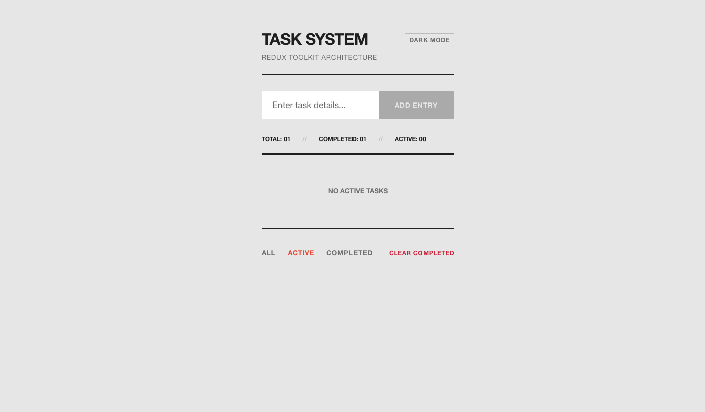
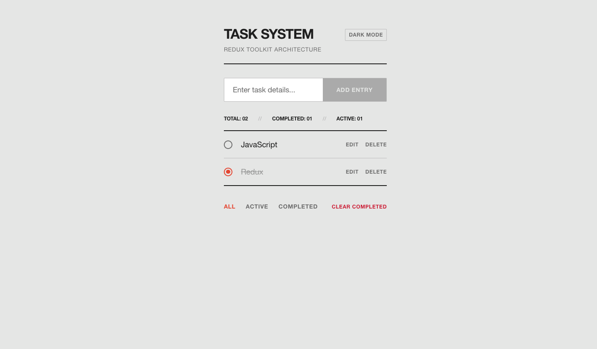

# Task System


A minimal, industrial-themed React application built to demonstrate core state management principles using Redux Toolkit. 

This project is part of a Redux Toolkit learning hackathon, focusing on building a strict unidirectional data flow (UI → Actions → Reducers → State) rather than relying on complex UI frameworks.

## Screenshots

| Home | Edit Task |
| :---: | :---: |
|  |  |

## Features

- **State Management:** Fully utilizes Redux Toolkit (`configureStore`, `createSlice`) for all CRUD operations.
- **Task Management:** Add, inline update, delete, and toggle task completion.
- **Filtering & Stats:** Filter tasks by status (All, Active, Completed) and view real-time task counts derived from the Redux store.
- **Data Persistence:** Automatically syncs the Redux state to `localStorage` across sessions.
- **Accessibility:** Built with semantic HTML, ARIA labels, error validation, and keyboard navigation.
- **Custom Theming:** Unique industrial hardware design aesthetic with a built-in Dark/Light mode toggle.

## Tech Stack

- React 18
- Redux Toolkit (`@reduxjs/toolkit`, `react-redux`)
- Vite
- Vanilla CSS

## Getting Started

1. **Install dependencies:**
   ```bash
   npm install
   ```

2. **Start the development server:**
   ```bash
   npm run dev
   ```

3. **Build for production:**
   ```bash
   npm run build
   ```

## Architecture Focus

All global state logic is isolated in `src/features/todos/todoSlice.js`. The UI components (`TodoList.jsx`, `TodoForm.jsx`, `TodoItem.jsx`) remain completely stateless regarding tasks, they purely dispatch actions and read derived state using `useSelector`.
